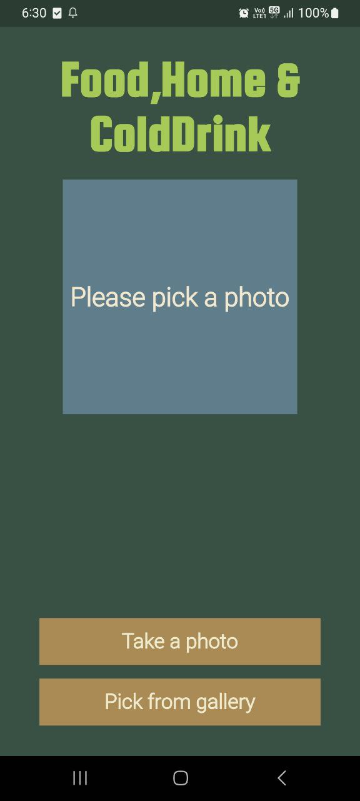
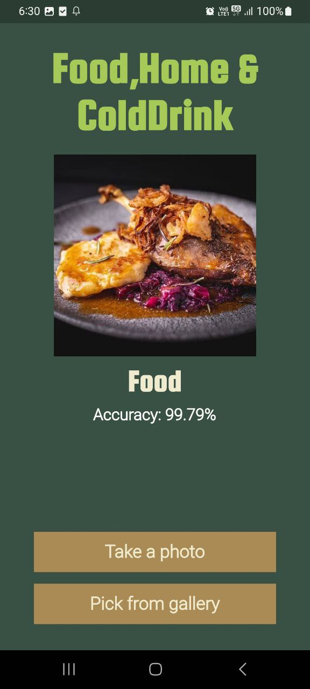

# Food, Home And ColdDrink Recogniser ML Project :Image Recognition App using TensorFlow in Flutter

        Initial project just for testing teachable machine and flutter integration

        Developed a mobile application utilizing Flutter and TensorFlow, enabling real-time image recognition.

        Designed an intuitive user interface for image capture and result display, ensuring a user-friendly experience.

        Demonstrated proficiency in mobile app development and machine learning integration, showcasing technical and problem-solving skills.

### Some Screenshots

# Pre-Processing Screen
  

# Post-processing Screen  
   
 

# Installation Process

        Step 1: Clone the repo by using terminal

                    git clone git@github.com:theneoalpha/food_home_colddrink_recogniser.git

        Step 2 : Open the project in your IDE

                    cd food_home_colddrink_recogniser

        Step 3: Run flutter pub get

                    flutter pub get

        Step 4: Run the Project                                    

